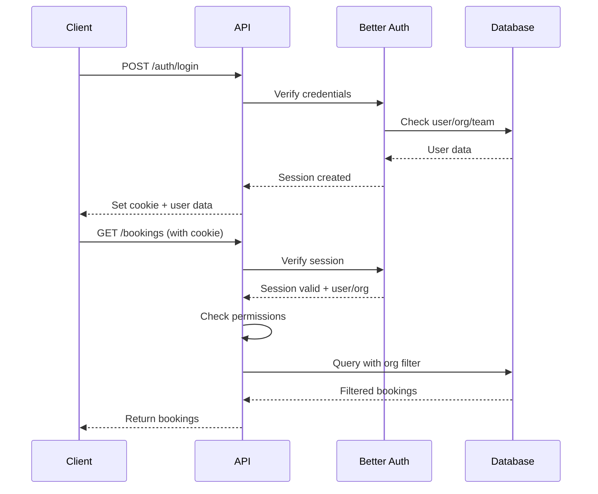

# Backend Architecture

## Service Architecture

### Traditional Server Architecture

#### Controller/Route Organization
```text
app/
└── api/
    └── [[...route]]/
        └── route.ts          # Main Hono app
server/
├── routes/                   # Route definitions
│   ├── auth.routes.ts
│   ├── bookings.routes.ts
│   ├── documents.routes.ts
│   ├── specialists.routes.ts
│   └── admin.routes.ts
├── services/                 # Business logic
│   ├── booking.service.ts
│   ├── document.service.ts
│   ├── acuity.service.ts
│   └── audit.service.ts
├── repositories/            # Data access layer
│   ├── booking.repository.ts
│   └── document.repository.ts
├── middleware/              # Hono middleware
│   ├── auth.middleware.ts
│   ├── validate.middleware.ts
│   └── audit.middleware.ts
└── lib/                     # Utilities
    ├── db.ts               # Drizzle client
    ├── redis.ts            # Redis client
    └── s3.ts               # S3 client
```

#### Controller Template
```typescript
// server/routes/bookings.routes.ts
import { Hono } from 'hono';
import { type } from 'arktype';
import { bookingService } from '@/server/services/booking.service';
import { authMiddleware } from '@/server/middleware/auth.middleware';
import { validate } from '@/server/middleware/validate.middleware';

const bookingsRouter = new Hono()
  .use('*', authMiddleware)
  
  // List bookings with filters
  .get('/', 
    validate('query', type({
      status: "'active' | 'closed' | 'archived' | undefined",
      specialistIds: "string[] | undefined",
      search: "string | undefined",
      page: "number | undefined",
      limit: "number | undefined",
    })),
    async (c) => {
      const filters = c.req.valid('query');
      const user = c.get('user');
      
      const { data, pagination } = await bookingService.list(
        user,
        filters
      );
      
      return c.json({ data, pagination });
    }
  )
  
  // Create booking
  .post('/',
    validate('json', type({
      specialistId: "string",
      appointmentDateTime: "Date | string",
      examineeName: "string.trim",
      examineePhone: "string.trim",
      "examineeEmail?": "string.email",
      "notes?": "string",
    }).pipe((data) => ({
      ...data,
      appointmentDateTime: new Date(data.appointmentDateTime),
    }))),
    async (c) => {
      const data = c.req.valid('json');
      const user = c.get('user');
      
      const booking = await bookingService.create(user, data);
      
      return c.json(booking, 201);
    }
  )
  
  // Get booking details
  .get('/:id', async (c) => {
    const id = c.req.param('id');
    const user = c.get('user');
    
    const booking = await bookingService.getById(user, id);
    
    if (!booking) {
      return c.json({ error: 'Booking not found' }, 404);
    }
    
    return c.json(booking);
  })
  
  // Update booking progress
  .post('/:id/progress',
    validate('json', type({
      progress: `'scheduled' | 'rescheduled' | 'cancelled' | 
                 'no_show' | 'generating_report' | 'report_generated' | 
                 'payment_received'`,
      "notes?": "string",
    })),
    async (c) => {
      const id = c.req.param('id');
      const data = c.req.valid('json');
      const user = c.get('user');
      
      const progress = await bookingService.updateProgress(
        user,
        id,
        data
      );
      
      return c.json(progress, 201);
    }
  );

export { bookingsRouter };
```

## Database Architecture

### Schema Design
```typescript
// server/db/schema.ts
import { pgTable, varchar, timestamp, boolean, text, bigint, jsonb, index } from 'drizzle-orm/pg-core';
import { relations } from 'drizzle-orm';

export const specialists = pgTable('specialists', {
  id: varchar('id', { length: 255 }).primaryKey().defaultRandom(),
  userId: varchar('user_id', { length: 255 }).notNull(),
  acuityCalendarId: varchar('acuity_calendar_id', { length: 255 }).notNull().unique(),
  name: varchar('name', { length: 255 }).notNull(),
  specialty: varchar('specialty', { length: 255 }).notNull(),
  location: varchar('location', { length: 255 }),
  isActive: boolean('is_active').notNull().default(true),
  createdAt: timestamp('created_at', { withTimezone: true }).defaultNow(),
  updatedAt: timestamp('updated_at', { withTimezone: true }).defaultNow(),
}, (table) => ({
  userIdIdx: index('idx_specialists_user_id').on(table.userId),
  activeIdx: index('idx_specialists_active').on(table.isActive),
  acuityIdx: index('idx_specialists_acuity_calendar').on(table.acuityCalendarId),
}));

export const bookings = pgTable('bookings', {
  id: varchar('id', { length: 255 }).primaryKey().defaultRandom(),
  acuityAppointmentId: varchar('acuity_appointment_id', { length: 255 }).notNull().unique(),
  specialistId: varchar('specialist_id', { length: 255 }).notNull(),
  organizationId: varchar('organization_id', { length: 255 }).notNull(),
  teamId: varchar('team_id', { length: 255 }),
  createdById: varchar('created_by_id', { length: 255 }).notNull(),
  createdForId: varchar('created_for_id', { length: 255 }),
  examineeName: varchar('examinee_name', { length: 255 }).notNull(),
  examineePhone: varchar('examinee_phone', { length: 50 }).notNull(),
  examineeEmail: varchar('examinee_email', { length: 255 }),
  appointmentDate: timestamp('appointment_date', { withTimezone: true }).notNull(),
  appointmentType: varchar('appointment_type', { length: 50 }).notNull(),
  meetingLink: text('meeting_link'),
  status: varchar('status', { length: 50 }).notNull().default('active'),
  currentProgress: varchar('current_progress', { length: 50 }).notNull().default('scheduled'),
  source: varchar('source', { length: 50 }).notNull().default('portal'),
  externalCreatedBy: varchar('external_created_by', { length: 255 }),
  notes: text('notes'),
  createdAt: timestamp('created_at', { withTimezone: true }).defaultNow(),
  updatedAt: timestamp('updated_at', { withTimezone: true }).defaultNow(),
}, (table) => ({
  specialistIdx: index('idx_bookings_specialist').on(table.specialistId),
  organizationIdx: index('idx_bookings_organization').on(table.organizationId),
  appointmentDateIdx: index('idx_bookings_appointment_date').on(table.appointmentDate),
  statusIdx: index('idx_bookings_status').on(table.status),
  acuityIdx: index('idx_bookings_acuity').on(table.acuityAppointmentId),
}));

// Relations
export const bookingsRelations = relations(bookings, ({ one, many }) => ({
  specialist: one(specialists, {
    fields: [bookings.specialistId],
    references: [specialists.id],
  }),
  progress: many(bookingProgress),
  documents: many(documents),
}));
```

### Data Access Layer
```typescript
// server/repositories/booking.repository.ts
import { db } from '@/server/lib/db';
import { bookings, bookingProgress, specialists } from '@/server/db/schema';
import { eq, and, inArray, like, gte, lte } from 'drizzle-orm';
import type { BookingFilters, PaginationParams } from '@/types';

export const bookingRepository = {
  async findMany(
    organizationId: string,
    filters: BookingFilters & PaginationParams
  ) {
    const conditions = [
      eq(bookings.organizationId, organizationId),
    ];
    
    if (filters.status) {
      conditions.push(eq(bookings.status, filters.status));
    }
    
    if (filters.specialistIds?.length) {
      conditions.push(inArray(bookings.specialistId, filters.specialistIds));
    }
    
    if (filters.search) {
      conditions.push(
        like(bookings.examineeName, `%${filters.search}%`)
      );
    }
    
    if (filters.startDate) {
      conditions.push(gte(bookings.appointmentDate, filters.startDate));
    }
    
    if (filters.endDate) {
      conditions.push(lte(bookings.appointmentDate, filters.endDate));
    }
    
    const limit = filters.limit || 20;
    const offset = ((filters.page || 1) - 1) * limit;
    
    const [data, count] = await Promise.all([
      db.query.bookings.findMany({
        where: and(...conditions),
        with: {
          specialist: true,
          progress: {
            orderBy: (progress, { desc }) => [desc(progress.createdAt)],
            limit: 1,
          },
        },
        limit,
        offset,
        orderBy: (bookings, { desc }) => [desc(bookings.appointmentDate)],
      }),
      db.select({ count: count() })
        .from(bookings)
        .where(and(...conditions)),
    ]);
    
    return {
      data,
      pagination: {
        page: filters.page || 1,
        limit,
        total: count[0].count,
        totalPages: Math.ceil(count[0].count / limit),
      },
    };
  },
  
  async findById(id: string, organizationId: string) {
    return db.query.bookings.findFirst({
      where: and(
        eq(bookings.id, id),
        eq(bookings.organizationId, organizationId)
      ),
      with: {
        specialist: true,
        progress: {
          orderBy: (progress, { desc }) => [desc(progress.createdAt)],
        },
        documents: {
          orderBy: (documents, { desc }) => [desc(documents.createdAt)],
        },
      },
    });
  },
  
  async create(data: typeof bookings.$inferInsert) {
    const [booking] = await db.insert(bookings)
      .values(data)
      .returning();
    
    // Create initial progress entry
    await db.insert(bookingProgress).values({
      bookingId: booking.id,
      progress: 'scheduled',
      changedById: data.createdById,
      changedForId: data.createdForId,
      notes: 'Booking created',
    });
    
    return booking;
  },
  
  async updateProgress(
    id: string,
    progress: string,
    changedById: string,
    changedForId?: string,
    notes?: string
  ) {
    // Update current progress
    await db.update(bookings)
      .set({ currentProgress: progress })
      .where(eq(bookings.id, id));
    
    // Add progress entry
    const [entry] = await db.insert(bookingProgress)
      .values({
        bookingId: id,
        progress,
        changedById,
        changedForId,
        notes,
      })
      .returning();
    
    return entry;
  },
};
```

## Authentication and Authorization

### Auth Flow


### Middleware/Guards
```typescript
// server/middleware/auth.middleware.ts
import { auth } from '@/lib/auth';
import type { Context, Next } from 'hono';

export async function authMiddleware(c: Context, next: Next) {
  const session = await auth();
  
  if (!session) {
    return c.json({ error: 'Unauthorized' }, 401);
  }
  
  // Add user to context
  c.set('user', session.user);
  c.set('organization', session.organization);
  c.set('impersonating', session.impersonating);
  
  await next();
}

// Role-based middleware
export function requireRole(role: 'admin' | 'user') {
  return async (c: Context, next: Next) => {
    const user = c.get('user');
    
    if (user.role !== role && role === 'admin') {
      return c.json({ error: 'Forbidden' }, 403);
    }
    
    await next();
  };
}

// Organization-based access
export async function checkBookingAccess(
  c: Context,
  bookingId: string
) {
  const user = c.get('user');
  const booking = await bookingRepository.findById(
    bookingId,
    user.organizationId
  );
  
  if (!booking) {
    return c.json({ error: 'Booking not found' }, 404);
  }
  
  // Additional checks based on role
  if (user.role === 'specialist') {
    if (booking.specialistId !== user.specialistId) {
      return c.json({ error: 'Forbidden' }, 403);
    }
  }
  
  return booking;
}
```
