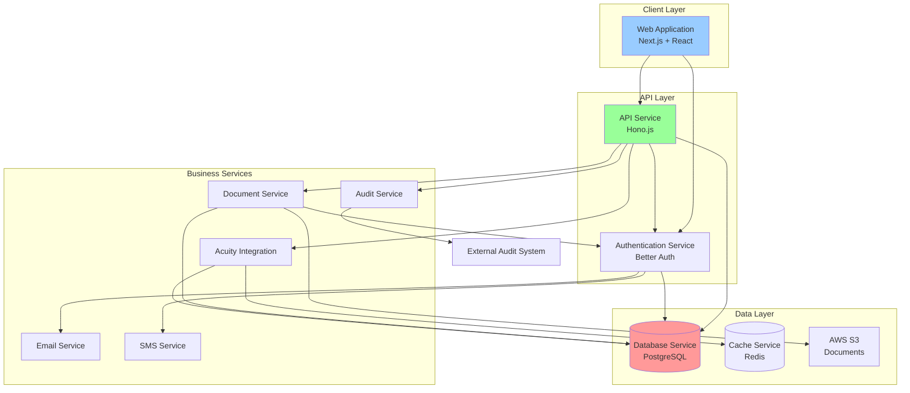

# Components

Based on the architectural patterns, tech stack, and data models from above, here are the major logical components/services and their responsibilities:

## Web Application (Next.js + React)
**Responsibility:** Serves the user interface, handles client-side routing, and manages frontend state

**Key Interfaces:**
- Server-side rendering for initial page loads
- Client-side routing for SPA-like navigation
- API client for backend communication
- WebSocket connection for real-time updates (future)

**Dependencies:** API Service, Authentication Service, Document Service

**Technology Stack:** Next.js 15, React, TypeScript, Shadcn UI, TanStack Query, TanStack Form

## API Service (Hono.js)
**Responsibility:** Handles all REST API endpoints, business logic orchestration, and data validation

**Key Interfaces:**
- RESTful endpoints as defined in API specification
- Request/response validation using ArkType
- Error handling and logging via Pino
- Webhook processing for Acuity events

**Dependencies:** Database Service, Authentication Service, Acuity Integration, Document Service, Cache Service

**Technology Stack:** Hono.js 4.5.0, TypeScript, ArkType for validation, Pino for logging

## Authentication Service (Better Auth)
**Responsibility:** Manages user authentication, authorization, sessions, and organization/team hierarchy

**Key Interfaces:**
- Login/logout endpoints
- Session management
- Role-based access control
- Organization and team membership APIs
- 2FA and phone verification
- Admin impersonation

**Dependencies:** Database Service, SMS Service (for phone verification), Email Service

**Technology Stack:** Better Auth with plugins (admin, organization, 2FA, phone), PostgreSQL for storage

## Database Service (PostgreSQL + Drizzle)
**Responsibility:** Persistent data storage, query optimization, and data integrity

**Key Interfaces:**
- Drizzle ORM repositories for each entity
- Transaction support for complex operations
- Migration management
- Connection pooling

**Dependencies:** None (base layer)

**Technology Stack:** PostgreSQL 15.4, Drizzle ORM 0.33.0, connection pooling via pg-pool

## Document Service
**Responsibility:** Secure document upload, storage, retrieval, and portal-proxy access

**Key Interfaces:**
- Upload API with virus scanning (future)
- Portal-proxied download endpoints
- S3 object management
- Document metadata CRUD
- Multipart upload for large files

**Dependencies:** Database Service (metadata), AWS S3 (storage), Authentication Service (access control)

**Technology Stack:** AWS S3 SDK, Node.js streams for proxy, multer for uploads

## Acuity Integration Service
**Responsibility:** Manages all interactions with Acuity Scheduling API

**Key Interfaces:**
- Appointment creation/update/cancellation
- Availability fetching with caching
- Calendar synchronization
- Webhook event processing
- Specialist calendar mapping

**Dependencies:** Cache Service (for availability), Database Service (for mapping)

**Technology Stack:** Acuity API client, Redis for caching, webhook signature verification

## Cache Service (Redis)
**Responsibility:** Improves performance through strategic caching of frequently accessed data

**Key Interfaces:**
- Key-value storage for session data
- Cached Acuity availability (5-minute TTL)
- Rate limiting counters
- Distributed locks (if needed)

**Dependencies:** None (supporting service)

**Technology Stack:** Redis 7.2, ioredis client

## Email Service
**Responsibility:** Sends transactional emails for bookings, invitations, and notifications

**Key Interfaces:**
- Send invitation emails
- Booking confirmations
- Password reset emails
- 2FA verification codes

**Dependencies:** AWS SES

**Technology Stack:** AWS SES, email templates with React Email

## SMS Service
**Responsibility:** Placeholder for future SMS functionality - currently not implemented

**Key Interfaces:**
- None currently active
- Future: Send verification codes
- Future: Phone number validation

**Dependencies:** None currently (will need SMS provider when implemented)

**Technology Stack:** Not implemented - Better Auth phone plugin will be configured but SMS sending disabled

## Audit Service
**Responsibility:** Captures and forwards all system events to external audit system

**Key Interfaces:**
- Structured logging via Pino
- Event capture for all state changes
- User action attribution
- Impersonation tracking

**Dependencies:** External audit system

**Technology Stack:** Pino logger, structured JSON output

## Component Diagrams

