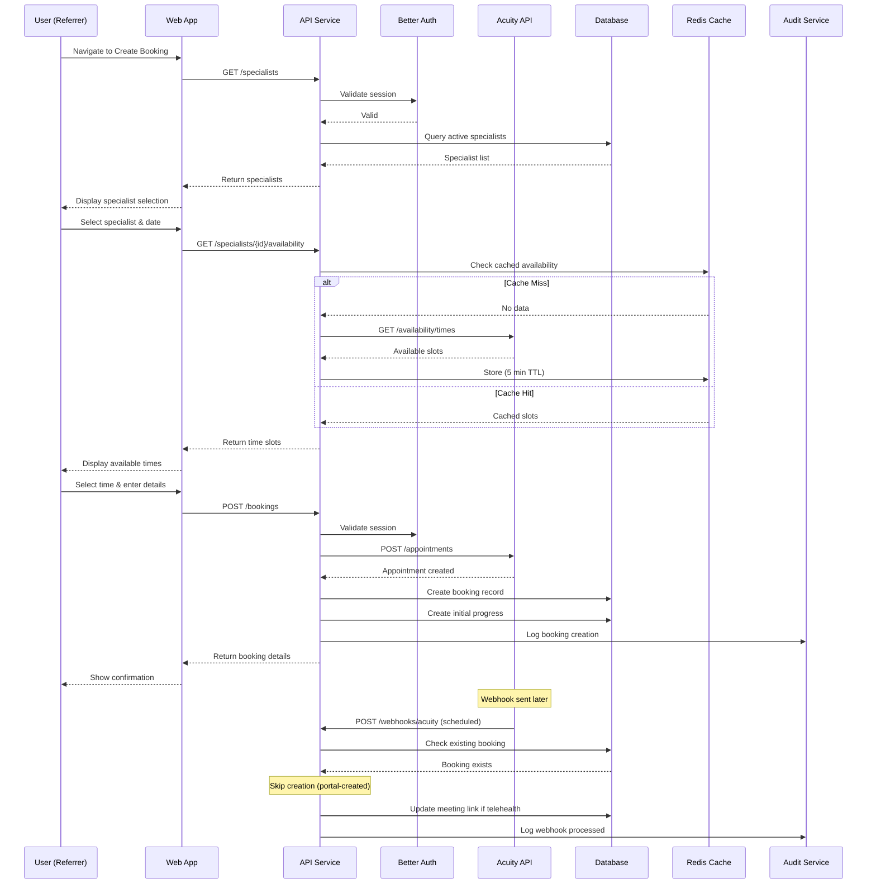
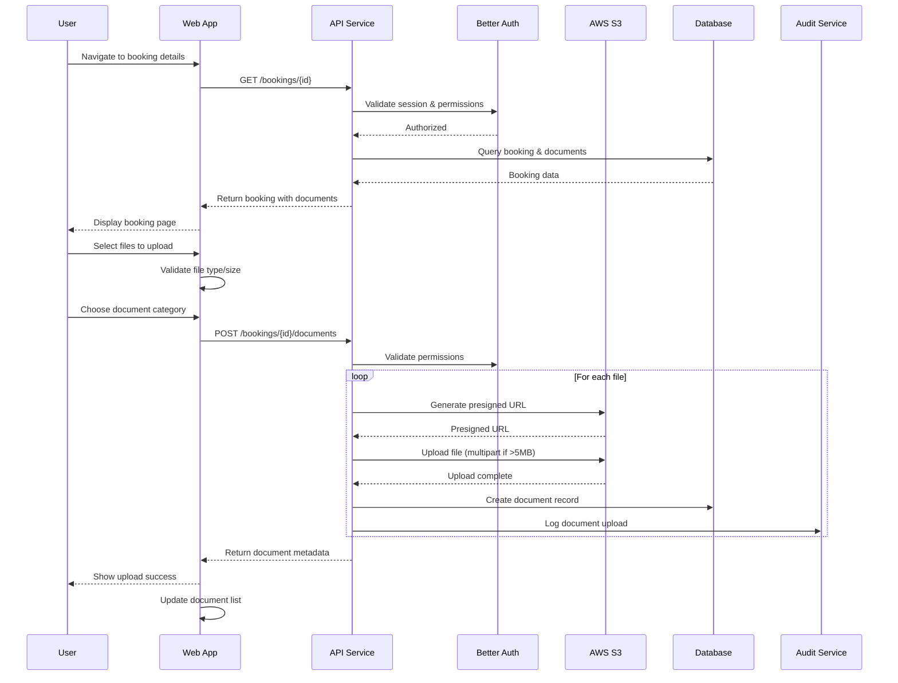
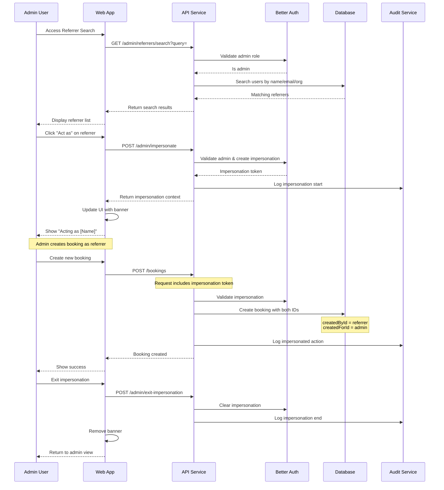
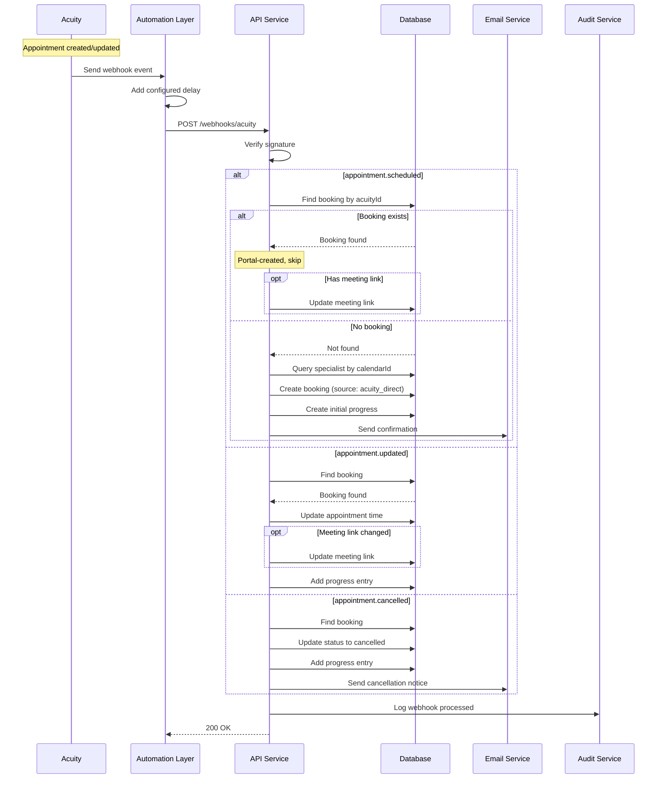

# Core Workflows

## Booking Creation Workflow

```mermaid
sequenceDiagram
    participant U as User (Referrer)
    participant W as Web App
    participant API as API Service
    participant Auth as Better Auth
    participant Acuity as Acuity API
    participant DB as Database
    participant Cache as Redis Cache
    participant Audit as Audit Service

    U->>W: Navigate to Create Booking
    W->>API: GET /specialists
    API->>Auth: Validate session
    Auth-->>API: Valid
    API->>DB: Query active specialists
    DB-->>API: Specialist list
    API-->>W: Return specialists
    W-->>U: Display specialist selection

    U->>W: Select specialist & date
    W->>API: GET /specialists/{id}/availability
    API->>Cache: Check cached availability
    alt Cache Miss
        Cache-->>API: No data
        API->>Acuity: GET /availability/times
        Acuity-->>API: Available slots
        API->>Cache: Store (5 min TTL)
    else Cache Hit
        Cache-->>API: Cached slots
    end
    API-->>W: Return time slots
    W-->>U: Display available times

    U->>W: Select time & enter details
    W->>API: POST /bookings
    API->>Auth: Validate session
    API->>Acuity: POST /appointments
    Acuity-->>API: Appointment created
    API->>DB: Create booking record
    API->>DB: Create initial progress
    API->>Audit: Log booking creation
    API-->>W: Return booking details
    W-->>U: Show confirmation

    Note over Acuity: Webhook sent later
    Acuity->>API: POST /webhooks/acuity (scheduled)
    API->>DB: Check existing booking
    DB-->>API: Booking exists
    Note over API: Skip creation (portal-created)
    API->>DB: Update meeting link if telehealth
    API->>Audit: Log webhook processed
```

## Document Upload Workflow

```mermaid
sequenceDiagram
    participant U as User
    participant W as Web App
    participant API as API Service
    participant Auth as Better Auth
    participant S3 as AWS S3
    participant DB as Database
    participant Audit as Audit Service

    U->>W: Navigate to booking details
    W->>API: GET /bookings/{id}
    API->>Auth: Validate session & permissions
    Auth-->>API: Authorized
    API->>DB: Query booking & documents
    DB-->>API: Booking data
    API-->>W: Return booking with documents
    W-->>U: Display booking page

    U->>W: Select files to upload
    W->>W: Validate file type/size
    U->>W: Choose document category
    W->>API: POST /bookings/{id}/documents
    API->>Auth: Validate permissions
    
    loop For each file
        API->>S3: Generate presigned URL
        S3-->>API: Presigned URL
        API->>S3: Upload file (multipart if >5MB)
        S3-->>API: Upload complete
        API->>DB: Create document record
        API->>Audit: Log document upload
    end
    
    API-->>W: Return document metadata
    W-->>U: Show upload success
    W->>W: Update document list
```

## Admin Impersonation Workflow

```mermaid
sequenceDiagram
    participant A as Admin User
    participant W as Web App
    participant API as API Service
    participant Auth as Better Auth
    participant DB as Database
    participant Audit as Audit Service

    A->>W: Access Referrer Search
    W->>API: GET /admin/referrers/search?query=
    API->>Auth: Validate admin role
    Auth-->>API: Is admin
    API->>DB: Search users by name/email/org
    DB-->>API: Matching referrers
    API-->>W: Return search results
    W-->>A: Display referrer list

    A->>W: Click "Act as" on referrer
    W->>API: POST /admin/impersonate
    API->>Auth: Validate admin & create impersonation
    Auth-->>API: Impersonation token
    API->>Audit: Log impersonation start
    API-->>W: Return impersonation context
    W->>W: Update UI with banner
    W-->>A: Show "Acting as [Name]"

    Note over A,W: Admin creates booking as referrer
    A->>W: Create new booking
    W->>API: POST /bookings
    Note over API: Request includes impersonation token
    API->>Auth: Validate impersonation
    API->>DB: Create booking with both IDs
    Note over DB: createdById = referrer<br/>createdForId = admin
    API->>Audit: Log impersonated action
    API-->>W: Booking created
    W-->>A: Show success

    A->>W: Exit impersonation
    W->>API: POST /admin/exit-impersonation
    API->>Auth: Clear impersonation
    API->>Audit: Log impersonation end
    W->>W: Remove banner
    W-->>A: Return to admin view
```

## Webhook Processing Workflow

```mermaid
sequenceDiagram
    participant Acuity as Acuity
    participant Auto as Automation Layer
    participant API as API Service
    participant DB as Database
    participant Email as Email Service
    participant Audit as Audit Service

    Note over Acuity: Appointment created/updated
    Acuity->>Auto: Send webhook event
    Auto->>Auto: Add configured delay
    Auto->>API: POST /webhooks/acuity
    API->>API: Verify signature
    
    alt appointment.scheduled
        API->>DB: Find booking by acuityId
        alt Booking exists
            DB-->>API: Booking found
            Note over API: Portal-created, skip
            opt Has meeting link
                API->>DB: Update meeting link
            end
        else No booking
            DB-->>API: Not found
            API->>DB: Query specialist by calendarId
            API->>DB: Create booking (source: acuity_direct)
            API->>DB: Create initial progress
            API->>Email: Send confirmation
        end
    else appointment.updated
        API->>DB: Find booking
        DB-->>API: Booking found
        API->>DB: Update appointment time
        opt Meeting link changed
            API->>DB: Update meeting link
        end
        API->>DB: Add progress entry
    else appointment.cancelled
        API->>DB: Find booking
        API->>DB: Update status to cancelled
        API->>DB: Add progress entry
        API->>Email: Send cancellation notice
    end
    
    API->>Audit: Log webhook processed
    API-->>Auto: 200 OK
```
