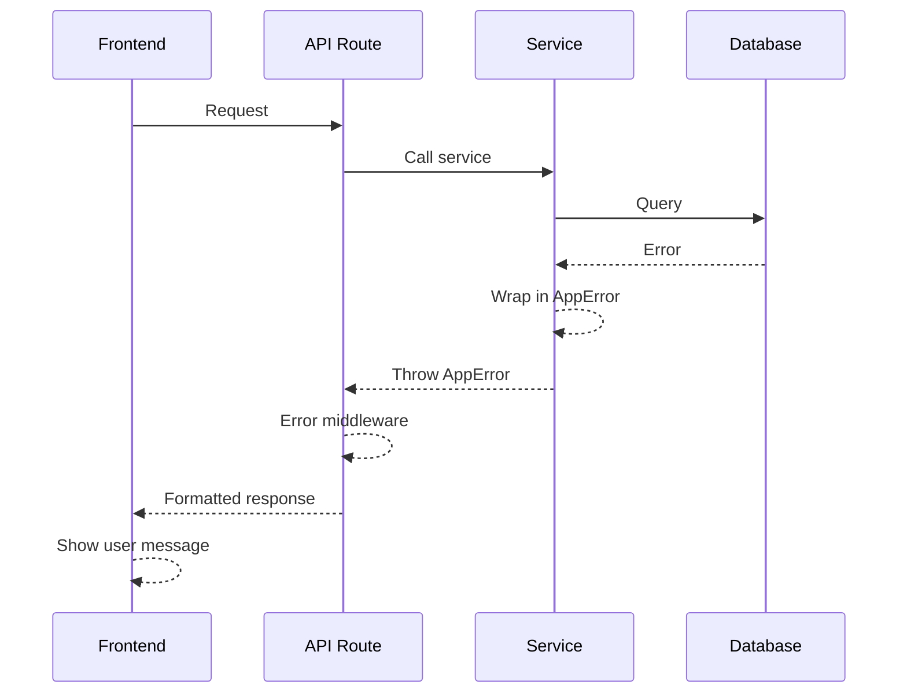

# Error Handling Strategy

## Error Flow


## Error Response Format
```typescript
interface ApiError {
  error: {
    code: string;
    message: string;
    details?: Record<string, any>;
    timestamp: string;
    requestId: string;
  };
}
```

## Frontend Error Handling
```typescript
// hooks/use-error-handler.ts
export function useErrorHandler() {
  return (error: unknown) => {
    if (error instanceof ApiError) {
      // Show specific error message
      toast.error(error.message);
    } else if (error instanceof NetworkError) {
      toast.error('Connection failed. Please check your internet.');
    } else {
      toast.error('Something went wrong. Please try again.');
      console.error(error);
    }
  };
}
```

## Backend Error Handling
```typescript
// server/middleware/error.middleware.ts
export function errorMiddleware(err: Error, c: Context) {
  const requestId = c.get('requestId');
  
  // Log to audit system
  logger.error({
    error: err.message,
    stack: err.stack,
    requestId,
    userId: c.get('user')?.id,
  });
  
  if (err instanceof AppError) {
    return c.json({
      error: {
        code: err.code,
        message: err.message,
        details: err.details,
        timestamp: new Date().toISOString(),
        requestId,
      }
    }, err.statusCode);
  }
  
  // Don't leak internal errors
  return c.json({
    error: {
      code: 'INTERNAL_ERROR',
      message: 'An unexpected error occurred',
      timestamp: new Date().toISOString(),
      requestId,
    }
  }, 500);
}
```
