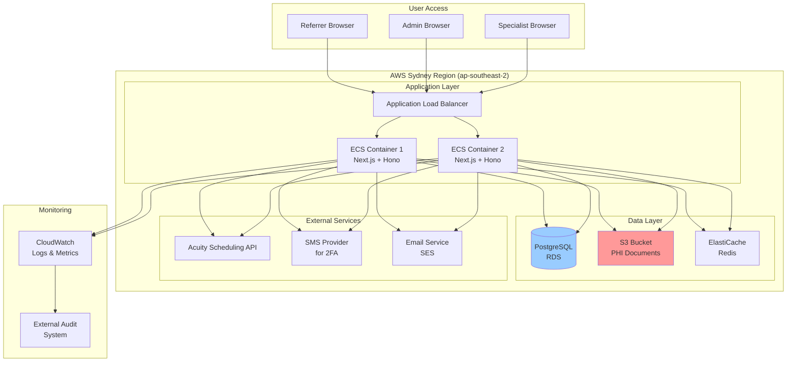

# High Level Architecture

## Technical Summary

The Medical Examination Booking Platform employs a modern fullstack architecture using Next.js 15 with integrated Hono.js API routes, deployed on AWS infrastructure. The frontend leverages React Server Components and Shadcn UI for a responsive, accessible interface, while the backend uses Drizzle ORM with PostgreSQL for type-safe data access. Key integration points include Better Auth for comprehensive authentication/authorization, Acuity Scheduling for calendar management, and AWS S3 with portal-proxy pattern for secure document storage. This architecture achieves PRD goals by enabling sub-3-minute booking creation, maintaining HIPAA compliance through encrypted PHI handling, and supporting horizontal scaling to handle 150+ monthly bookings without additional administrative overhead.

## Platform and Infrastructure Choice

**Platform:** AWS (Amazon Web Services)  
**Key Services:** EC2/ECS (container hosting), RDS PostgreSQL (database), S3 (document storage), CloudWatch (monitoring), Route 53 (DNS), ALB (load balancing)  
**Deployment Regions:** ap-southeast-2 (Sydney, Australia) - single region deployment for data residency compliance

## Repository Structure

**Structure:** Standard Next.js project repository  
**Package Manager:** pnpm (for efficient dependency management)  
**Project Organization:** 
- Single repository containing Next.js app with Hono API routes via `app/api/[[...route]]/route.ts`
- Shared types and utilities within the same codebase
- Simplified deployment as a single unit

## High Level Architecture Diagram

## Architectural Patterns

- **Next.js Full-Stack Architecture:** Unified application serving both frontend pages and API routes through Hono integration - _Rationale:_ Simplifies deployment and maintains type safety between frontend and backend in a single codebase
- **Repository Pattern:** Abstract database operations behind repository interfaces - _Rationale:_ Enables testing with mocks and potential future database migrations without changing business logic
- **Portal-Proxy Pattern:** All document access flows through application layer, never direct S3 URLs - _Rationale:_ Ensures every PHI document access is authenticated, authorized, and audited for compliance
- **Command Query Responsibility Segregation (CQRS) Lite:** Separate read models (list views) from write models (booking creation) - _Rationale:_ Optimizes performance for high-read scenarios like calendar views while maintaining consistency
- **Event-Driven Audit Trail:** All state changes emit events captured by Pino logger - _Rationale:_ Creates immutable audit log for compliance without impacting transaction performance
- **Backend for Frontend (BFF):** Hono API routes tailored specifically for Next.js frontend needs - _Rationale:_ Reduces over-fetching and enables optimal data shaping for UI components
- **Dependency Injection:** Use of Better Auth plugins and Drizzle repositories with clear interfaces - _Rationale:_ Improves testability and allows swapping implementations (e.g., Acuity could be replaced)
- **Optimistic UI Updates:** Frontend immediately reflects user actions while backend processes - _Rationale:_ Provides responsive feel essential for sub-3-minute booking goal
