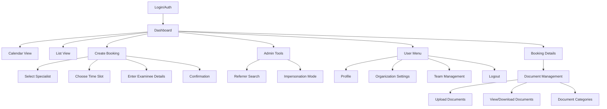
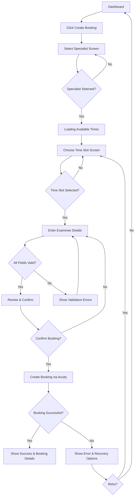
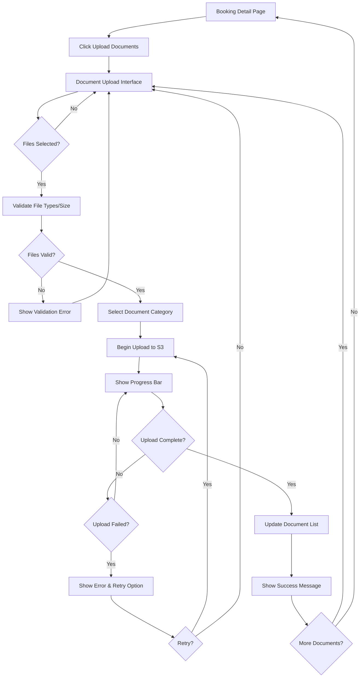
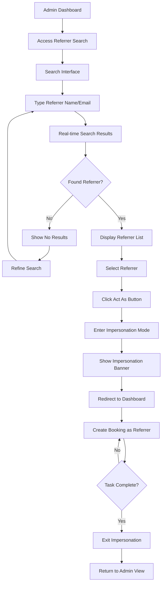

# Medical Examination Booking Platform UI/UX Specification

## Introduction

This document defines the user experience goals, information architecture, user flows, and visual design specifications for Medical Examination Booking Platform's user interface. It serves as the foundation for visual design and frontend development, ensuring a cohesive and user-centered experience.

### Overall UX Goals & Principles

#### Target User Personas

**Power Referrer:** High-volume personal injury lawyers who create 10+ bookings weekly and need maximum efficiency with keyboard shortcuts and bulk operations

**Occasional Referrer:** Lawyers who book IMEs infrequently (1-2 per month) and need clear guidance and intuitive workflows

**Admin Coordinator:** Internal staff managing phone-based bookings who need quick search and impersonation capabilities while multitasking

**Time-Conscious Specialist:** Medical professionals conducting multiple examinations daily who need streamlined access to relevant information

#### Usability Goals

- Efficiency of use: Experienced referrers complete bookings in under 2 minutes
- Ease of learning: New users successfully create first booking without training
- Error prevention: Clear validation prevents booking conflicts and missing information
- Memorability: Returning users navigate confidently after weeks of inactivity
- Satisfaction: Professional interface builds trust in the platform's security and reliability

#### Design Principles

1. **Clarity over complexity** - Every interface element has a clear purpose with no decorative distractions
2. **Status visibility** - Users always know where bookings stand in the examination workflow
3. **Efficiency through consistency** - Repeated patterns reduce cognitive load across all interfaces
4. **Respect user time** - Minimize clicks and page loads for common tasks
5. **Trust through transparency** - Security and compliance measures visible without being intrusive

### Change Log

| Date | Version | Description | Author |
|------|---------|-------------|--------|
| 2025-08-13 | 1.0 | Initial UI/UX specification creation | Sally (UX Expert) |

## Information Architecture (IA)

### Site Map / Screen Inventory

### Navigation Structure

**Primary Navigation:** Horizontal top bar with logo, main actions (Create Booking for referrers), user menu, and admin tools (for admin users only)

**Secondary Navigation:** Within dashboard views, toggle between Calendar and List views, with persistent filter controls (status, specialist, search)

**Breadcrumb Strategy:** Show hierarchical path on detail pages (Dashboard > Bookings > [Examinee Name]), with clickable segments for easy navigation back

## User Flows

### Booking Creation Flow

**User Goal:** Create a new IME booking quickly and accurately

**Entry Points:** 
- "Create Booking" button in primary navigation
- "New Booking" button on dashboard
- Quick action button on empty calendar slots (future enhancement)

**Success Criteria:** Booking confirmed with specialist and time slot reserved in under 3 minutes

#### Flow Diagram

#### Edge Cases & Error Handling:
- Specialist becomes unavailable between selection and confirmation - show alert and return to specialist selection
- Time slot taken by another user - refresh available times and prompt new selection
- Acuity API timeout - show retry option (user must re-enter data)
- Network disconnection - display error message and suggest checking connection
- Session timeout - redirect to login with return URL to booking creation start

**Notes:** No form data is preserved in browser storage for security compliance. Users must complete booking in one session.

### Document Upload Flow

**User Goal:** Upload examination-related documents to an existing booking

**Entry Points:**
- "Upload Documents" button on booking detail page
- "Add Documents" link in booking confirmation screen
- Document section within booking details

**Success Criteria:** Documents uploaded, categorized, and immediately accessible to authorized users

#### Flow Diagram

#### Edge Cases & Error Handling:
- File too large (>500MB) - show error before upload starts with file size limit
- Unsupported file type - highlight invalid files with accepted formats list
- Network interruption during upload - show failure with option to retry
- Session expires during upload - complete current upload, then redirect to login
- Concurrent uploads - support multiple file uploads with individual progress bars
- Large file handling - show estimated time remaining for files over 100MB

**Notes:** Portal-proxy ensures all document access is validated. No direct S3 URLs are ever exposed to users. Large medical files up to 500MB are supported.

### Admin Impersonation Flow

**User Goal:** Admin staff quickly finds and acts as a referrer to create bookings on their behalf

**Entry Points:**
- "Referrer Search" in admin tools (primary navigation for admin users only)
- Quick search shortcut (Cmd/Ctrl + K for power users)

**Success Criteria:** Admin finds correct referrer and enters impersonation mode in under 30 seconds

#### Flow Diagram

#### Edge Cases & Error Handling:
- Multiple referrers with similar names - show organization and email to differentiate
- Referrer not found - suggest checking spelling or partial matches
- Session timeout during impersonation - maintain impersonation state after re-login
- Accidental impersonation - require confirmation click to prevent misclicks
- Concurrent admin sessions - each admin's impersonation is independent

**Notes:** All actions during impersonation are logged with both admin and referrer IDs. Clear visual indication prevents admins from forgetting they're in impersonation mode.

## Wireframes & Mockups

**Primary Design Files:** This project will proceed directly to implementation without traditional design mockups. The UI will be built using Shadcn UI components with the defined color palette and design principles.

### Key Screen Layouts

#### Dashboard with Calendar View

**Purpose:** Primary interface showing all bookings in a visual monthly calendar format with filtering capabilities

**Key Elements:**
- Top navigation bar with logo, "Create Booking" button, user menu, and admin tools (if applicable)
- Filter controls bar: Status toggle (Active/Closed), Specialist multi-select dropdown, Search input for examinee names
- Monthly calendar grid with day cells showing booking cards (time, examinee name, specialist initials)
- Calendar navigation (previous/next month, today button)
- View toggle to switch between Calendar and List views

**Interaction Notes:** Clicking any booking card opens a preview tooltip with basic info and "View Details" button. Empty calendar days show subtle "+" icon on hover for future quick booking feature. Filters apply instantly without page reload.

#### Booking Creation Wizard - Specialist Selection

**Purpose:** First step of booking creation where users choose which medical specialist to book

**Key Elements:**
- Progress indicator showing 3 steps (Select Specialist → Choose Time → Enter Details)
- Search bar to filter specialists by name or specialty
- Specialist cards in a grid layout showing: name, specialty, location, next available slot
- Selected specialist highlighted with primary color (#8f693d) border
- "Continue" button (disabled until selection made)

**Interaction Notes:** Real-time search filters specialist list as user types. Specialist cards are clickable anywhere within bounds. Loading state shows skeleton cards while fetching availability.

#### Booking Detail Page

**Purpose:** Comprehensive view of a single booking with all information and actions available

**Key Elements:**
- Breadcrumb navigation (Dashboard > Bookings > [Examinee Name])
- Header section: Examinee name, booking date/time, specialist name
- Status badge and progress tracker showing current stage
- Document management section with upload button and document list
- Activity timeline showing all status changes with timestamps and user attribution
- Action buttons based on user role (Update Status, Upload Documents, Cancel Booking)

**Interaction Notes:** Document section uses drag-and-drop with visual feedback. Status updates trigger confirmation modal. All actions immediately reflected in activity timeline.

## Component Library / Design System

**Design System Approach:** The platform will use Shadcn UI as the foundation component library, customized with the medical-legal professional aesthetic. Components will be configured with the #8f693d primary color and extended as needed for domain-specific requirements. No separate design system will be maintained - Shadcn UI's built-in consistency and accessibility features will ensure a cohesive experience.

### Core Components

#### Button

**Purpose:** Primary interactive element for all user actions across the platform

**Variants:** Primary (filled #8f693d), Secondary (outline), Destructive (red for dangerous actions), Ghost (minimal for less important actions)

**States:** Default, Hover, Active, Disabled, Loading (with spinner)

**Usage Guidelines:** Primary buttons for main actions (Create Booking, Save), Secondary for alternative actions (Cancel, Back), Destructive only for irreversible actions with confirmation

#### Form Input

**Purpose:** Text entry for all data collection needs

**Variants:** Default text input, Password (masked), Search (with icon), Textarea (multi-line)

**States:** Default, Focused, Error, Disabled, Read-only

**Usage Guidelines:** Always include clear labels, use placeholder text sparingly, show validation errors below field with red text, include helper text for complex requirements

#### Select/Dropdown

**Purpose:** Allow users to choose from predefined options

**Variants:** Single select, Multi-select (for specialist filter), Searchable select (for long lists)

**States:** Default, Open, Selected, Disabled, Error

**Usage Guidelines:** Use for 5+ options (otherwise use radio buttons), include search for 10+ items, show selected count for multi-select, sort options logically (alphabetical or by frequency)

#### Data Table

**Purpose:** Display booking lists and other tabular data

**Variants:** Basic table, Sortable columns, With row actions, With pagination

**States:** Default, Loading (skeleton rows), Empty, Error

**Usage Guidelines:** Include column headers with sort indicators, highlight rows on hover, use consistent date/time formatting, support responsive collapse on mobile

#### Status Badge

**Purpose:** Communicate booking and document status at a glance

**Variants:** Active (green), Closed (gray), Archived (dark gray), Progress stages (various colors)

**States:** Default only (non-interactive)

**Usage Guidelines:** Use consistent colors across platform, include icon where helpful, keep text concise, position consistently in layouts

## Branding & Style Guide

### Visual Identity

**Brand Guidelines:** The Medical Examination Booking Platform embodies professionalism, trust, and efficiency through a refined medical-legal aesthetic. The visual design balances warmth with authority, using earth-toned colors that convey stability and reliability without the clinical coldness often associated with medical platforms.

### Color Palette

| Color Type | Hex Code | Usage |
|------------|----------|--------|
| Primary | #8f693d | Primary buttons, active states, key CTAs, links |
| Secondary | #d4b896 | Hover states, secondary accents, selected items |
| Accent | #507255 | Success messages, positive status indicators |
| Success | #22c55e | Successful operations, completed status |
| Warning | #f59e0b | Warnings, attention-needed states |
| Error | #ef4444 | Error messages, destructive actions |
| Neutral | #f7f5f3 (light), #e8e5e1 (border), #6b6560 (text) | Backgrounds, borders, body text |

### Typography

#### Font Families
- **Primary:** Inter or system font stack - clean, highly legible for body text
- **Secondary:** Inter or system font stack - maintains consistency
- **Monospace:** 'Fira Code', 'Cascadia Code', monospace - for IDs, codes, technical data

#### Type Scale
| Element | Size | Weight | Line Height |
|---------|------|--------|-------------|
| H1 | 2.25rem (36px) | 700 | 1.2 |
| H2 | 1.875rem (30px) | 600 | 1.3 |
| H3 | 1.5rem (24px) | 600 | 1.4 |
| Body | 1rem (16px) | 400 | 1.5 |
| Small | 0.875rem (14px) | 400 | 1.4 |

### Iconography

**Icon Library:** Lucide React icons for consistency with Shadcn UI

**Usage Guidelines:** 
- Use outline style for consistency
- Maintain 20px default size, scale proportionally
- Include aria-labels for standalone icons
- Pair icons with text labels for critical actions

### Spacing & Layout

**Grid System:** 12-column grid with 24px gutters for desktop, 8-column for tablet, 4-column for mobile

**Spacing Scale:** Base unit of 4px - use multiples (4, 8, 12, 16, 24, 32, 48, 64) for all spacing decisions

## Accessibility Requirements

### Compliance Target

**Standard:** WCAG 2.1 Level AA compliance as the minimum baseline, with selected AAA criteria where feasible for critical user flows

### Key Requirements

**Visual:**
- Color contrast ratios: Minimum 4.5:1 for normal text, 3:1 for large text (18pt+), 3:1 for UI components
- Focus indicators: Visible keyboard focus with 2px outline using primary color (#8f693d) or sufficient contrast
- Text sizing: Base font 16px minimum, support browser zoom to 200% without horizontal scrolling

**Interaction:**
- Keyboard navigation: All interactive elements accessible via keyboard, logical tab order, skip links for main content
- Screen reader support: Semantic HTML, ARIA labels for icons, live regions for dynamic updates, form associations
- Touch targets: Minimum 44x44px for all clickable elements, adequate spacing between targets

**Content:**
- Alternative text: Descriptive alt text for all informative images, empty alt for decorative images
- Heading structure: Logical H1-H6 hierarchy, one H1 per page, no skipped levels
- Form labels: Every input has associated label, required fields marked with text (not just color), error messages linked to fields

### Testing Strategy

Regular accessibility audits using automated tools (axe DevTools) combined with manual keyboard navigation testing and screen reader testing with NVDA/JAWS. Include users with disabilities in user testing sessions when possible. Document and prioritize fixing any accessibility issues found.

## Responsiveness Strategy

### Breakpoints

| Breakpoint | Min Width | Max Width | Target Devices |
|------------|-----------|-----------|----------------|
| Mobile | 320px | 767px | Smartphones, small tablets |
| Tablet | 768px | 1023px | iPads, tablets, small laptops |
| Desktop | 1024px | 1439px | Laptops, standard monitors |
| Wide | 1440px | - | Large monitors, ultra-wide displays |

### Adaptation Patterns

**Layout Changes:** 
- Mobile: Single column layouts, stacked navigation, full-width components
- Tablet: Two-column layouts where appropriate, condensed navigation
- Desktop: Full multi-column layouts, side-by-side panels, expanded navigation
- Wide: Centered content with max-width containers, additional sidebar information

**Navigation Changes:**
- Mobile: Hamburger menu, bottom sheet for filters, simplified top bar
- Tablet: Collapsible sidebar, dropdown navigation, persistent filter bar
- Desktop+: Full horizontal navigation, always-visible filters, quick actions

**Content Priority:**
- Mobile: Essential information only, progressive disclosure via accordions, hide table columns
- Tablet: Show more table columns, expand some collapsed sections
- Desktop+: All information visible, full data tables, expanded details

**Interaction Changes:**
- Mobile: Touch-optimized with larger targets, swipe gestures for navigation, bottom sheets for modals
- Tablet: Mixed touch/mouse optimization, hover states on capable devices
- Desktop+: Full hover interactions, keyboard shortcuts enabled, right-click context menus

## Animation & Micro-interactions

### Motion Principles

1. **Purpose over polish** - Every animation serves a functional purpose: provide feedback, guide attention, or maintain context
2. **Snappy and responsive** - Keep durations short (200-300ms) for immediate feel, longer (400-500ms) only for major transitions
3. **Consistent easing** - Use ease-out for entrances, ease-in for exits, ease-in-out for movements
4. **Respect preferences** - Honor prefers-reduced-motion for users with motion sensitivity
5. **Performance first** - Prefer CSS transforms over layout changes, use GPU-accelerated properties

### Key Animations

- **Page Transitions:** Subtle fade between routes (Duration: 200ms, Easing: ease-out)
- **Modal/Dialog Entry:** Fade backdrop + scale-up content from 95% to 100% (Duration: 200ms, Easing: ease-out)
- **Dropdown Menus:** Slide down with slight fade (Duration: 150ms, Easing: ease-out)
- **Button Hover:** Background color transition (Duration: 150ms, Easing: ease)
- **Loading States:** Skeleton screens with shimmer effect (Duration: 1.5s, Easing: linear, infinite)
- **Form Validation:** Error messages slide down below fields (Duration: 200ms, Easing: ease-out)
- **Status Changes:** Brief highlight flash when booking status updates (Duration: 300ms, Easing: ease-in-out)
- **Drag & Drop:** Subtle scale on drag start, smooth position updates (Duration: immediate response, Easing: none)
- **Progress Indicators:** Smooth width transitions for progress bars (Duration: 300ms, Easing: ease-in-out)
- **Toast Notifications:** Slide in from top-right corner (Duration: 300ms, Easing: ease-out)

## Performance Considerations

### Performance Goals

- **Page Load:** Initial page load under 3 seconds on 4G connection, under 1.5 seconds on broadband
- **Interaction Response:** All user interactions respond within 100ms, async operations show loading state within 200ms
- **Animation FPS:** Maintain 60fps for all animations and scrolling, gracefully degrade on lower-end devices

### Design Strategies

1. **Progressive Loading** - Show skeleton screens immediately while data loads, prioritize above-fold content, lazy load images and heavy components
2. **Optimistic Updates** - Update UI immediately on user action, handle failures gracefully with rollback and clear messaging
3. **Smart Caching** - Cache specialist availability for 5 minutes, cache user preferences locally, invalidate strategically
4. **Minimize Layout Shifts** - Reserve space for dynamic content, specify image dimensions, avoid inserting content above existing elements
5. **Efficient Data Display** - Virtualize long lists (100+ items), paginate data tables (20 items default), use infinite scroll sparingly
6. **Asset Optimization** - Use WebP/AVIF for images with fallbacks, inline critical CSS, defer non-critical scripts, use font-display: swap

## Next Steps

### Immediate Actions

1. Set up Shadcn UI with custom theme configuration using #8f693d as primary color
2. Create component inventory mapping Shadcn components to our defined needs
3. Build interactive prototypes for key flows (booking creation, document upload)
4. Conduct accessibility audit on color contrast ratios with chosen palette
5. Test responsive breakpoints with actual content to verify layout decisions
6. Create loading state examples for all async operations
7. Document component usage patterns for development team
8. Establish icon usage guidelines with Lucide React examples

### Design Handoff Checklist

- [x] All user flows documented
- [x] Component inventory complete
- [x] Accessibility requirements defined
- [x] Responsive strategy clear
- [x] Brand guidelines incorporated
- [x] Performance goals established
- [ ] Color contrast ratios verified (needs testing with #8f693d)
- [ ] Loading states designed for all async operations
- [ ] Error states defined for all user inputs
- [ ] Empty states created for all data views
- [ ] Animation timing documented in developer-ready format
- [ ] Touch target sizes verified for mobile compatibility

## Checklist Results

No formal UI/UX checklist was run against this document. The design handoff checklist above serves as the primary validation tool for this specification.
