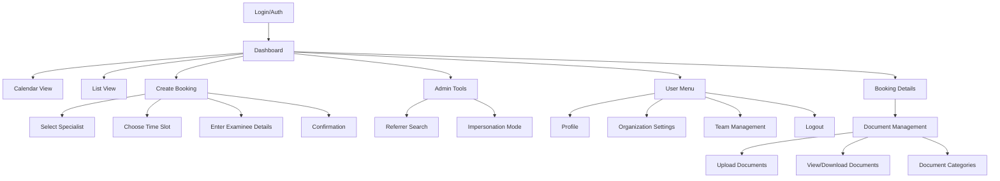

# Information Architecture (IA)

## Site Map / Screen Inventory

## Navigation Structure

**Primary Navigation:** Horizontal top bar with logo, main actions (Create Booking for referrers), user menu, and admin tools (for admin users only)

**Secondary Navigation:** Within dashboard views, toggle between Calendar and List views, with persistent filter controls (status, specialist, search)

**Breadcrumb Strategy:** Show hierarchical path on detail pages (Dashboard > Bookings > [Examinee Name]), with clickable segments for easy navigation back
