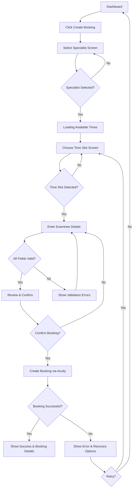
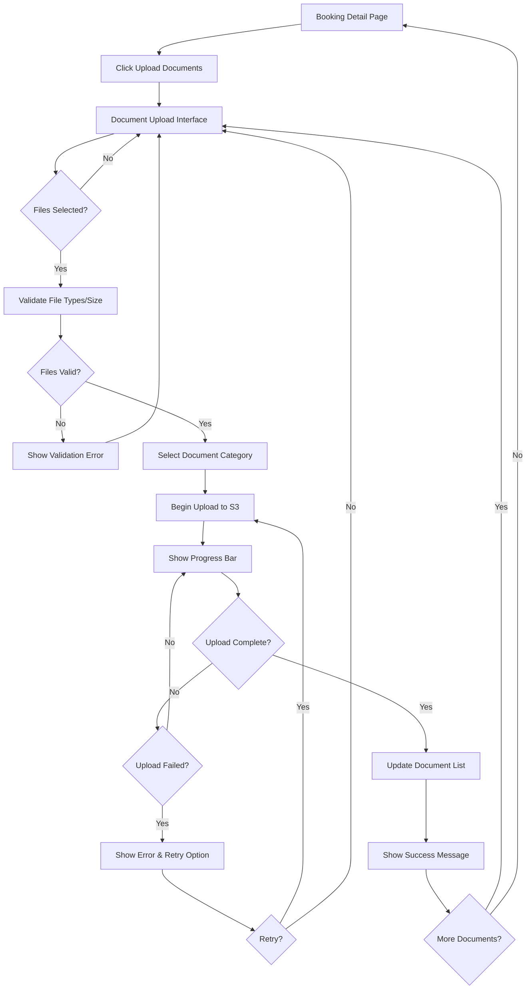
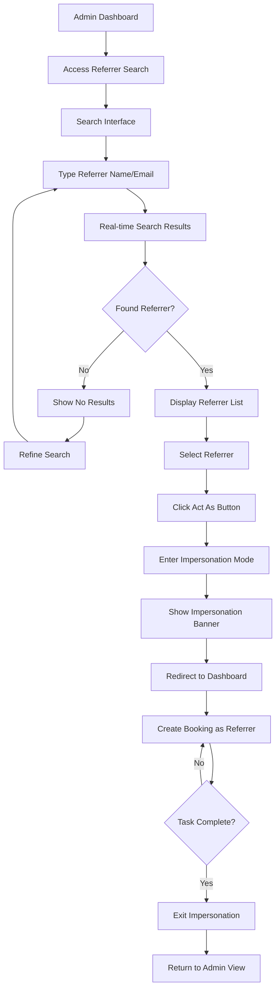

# User Flows

## Booking Creation Flow

**User Goal:** Create a new IME booking quickly and accurately

**Entry Points:** 
- "Create Booking" button in primary navigation
- "New Booking" button on dashboard
- Quick action button on empty calendar slots (future enhancement)

**Success Criteria:** Booking confirmed with specialist and time slot reserved in under 3 minutes

### Flow Diagram

### Edge Cases & Error Handling:
- Specialist becomes unavailable between selection and confirmation - show alert and return to specialist selection
- Time slot taken by another user - refresh available times and prompt new selection
- Acuity API timeout - show retry option (user must re-enter data)
- Network disconnection - display error message and suggest checking connection
- Session timeout - redirect to login with return URL to booking creation start

**Notes:** No form data is preserved in browser storage for security compliance. Users must complete booking in one session.

## Document Upload Flow

**User Goal:** Upload examination-related documents to an existing booking

**Entry Points:**
- "Upload Documents" button on booking detail page
- "Add Documents" link in booking confirmation screen
- Document section within booking details

**Success Criteria:** Documents uploaded, categorized, and immediately accessible to authorized users

### Flow Diagram

### Edge Cases & Error Handling:
- File too large (>500MB) - show error before upload starts with file size limit
- Unsupported file type - highlight invalid files with accepted formats list
- Network interruption during upload - show failure with option to retry
- Session expires during upload - complete current upload, then redirect to login
- Concurrent uploads - support multiple file uploads with individual progress bars
- Large file handling - show estimated time remaining for files over 100MB

**Notes:** Portal-proxy ensures all document access is validated. No direct S3 URLs are ever exposed to users. Large medical files up to 500MB are supported.

## Admin Impersonation Flow

**User Goal:** Admin staff quickly finds and acts as a referrer to create bookings on their behalf

**Entry Points:**
- "Referrer Search" in admin tools (primary navigation for admin users only)
- Quick search shortcut (Cmd/Ctrl + K for power users)

**Success Criteria:** Admin finds correct referrer and enters impersonation mode in under 30 seconds

### Flow Diagram

### Edge Cases & Error Handling:
- Multiple referrers with similar names - show organization and email to differentiate
- Referrer not found - suggest checking spelling or partial matches
- Session timeout during impersonation - maintain impersonation state after re-login
- Accidental impersonation - require confirmation click to prevent misclicks
- Concurrent admin sessions - each admin's impersonation is independent

**Notes:** All actions during impersonation are logged with both admin and referrer IDs. Clear visual indication prevents admins from forgetting they're in impersonation mode.
